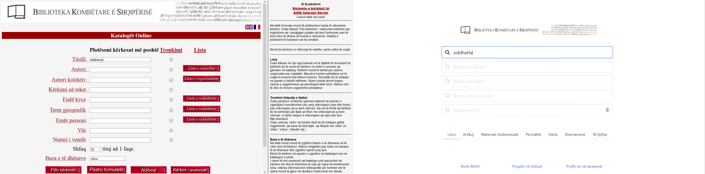
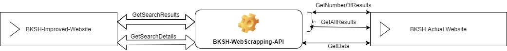

# BKSH-Improved-Website

Ridizenjim i shërbimit të kërkimeve në katalogët e [Biblotekës Kombëtare](http://www.bksh.al/Katalogu/library/wwwopac/wwwroot/beginner/index_al.html).

Sipas disa të dhënave kjo faqe është ndërtuar që në 2006 dhe nuk ka patur ndonjë përmirësim në GUI që atëherë.

Prandaj vendosa të bëj një dizajn më të kohës duke shfaqur të dhënat e njëjta si faqja aktuale.

## Linqet

**Linku i faqes aktuale të BKSH:** [http://www.bksh.al/Katalogu/library/wwwopac/wwwroot/beginner/index_al.html](http://www.bksh.al/Katalogu/library/wwwopac/wwwroot/beginner/index_al.html)  
**Faqja e hostuar në GearHost:** [http://bksh-improved-website.gear.host/](http://bksh-improved-website.gear.host/)  
**Faqja e hostuar në GithubPages:** [https://orgeskreka.github.io/BKSH-Improved-Website/](https://orgeskreka.github.io/BKSH-Improved-Website/)  
**Dokumentimi i API:** http://bksh-improved-website.gear.host/swagger/ui/index

> Çdo kritikë apo sugjerim është e mirëpritur.  
> Tek faqja është dhe profili im në facebook.

<b>Imazhe</b>

_Fig. 1: Forma e kërkimit tek faqja e BKSH dhe faqja e përmirësuar_

.png>)
_Fig. 2: Shfaqja e rezultateve tek faqja e BKSH dhe faqja e përmirësuar_

# Funksionimi

Duke qenë se BKSH nuk ka ndonjë API ( të paktën jo publik ) për të dhënat e saj, mënyra e vetme për të marrë të dhëna është duke i nxjerrë nga faqja aktuale.
Kështu projekti ka një servis ueb të ndërtuar me .net që merr nga forma html të dhënën që do të kërkohet, e kërkon tek faqja aktuale e BKSH dhe përmbajtjen e kthyer e përpunon duke hequr taget html apo duke formatuar të dhënat sipas modeleve që kam përcaktuar. Në fund i kthen këto të dhëna duke i ekspozuar sipas protokollit http.

Thërritjet e faqes dhe marrja e të dhënave nga faqja aktuale e BKSH bëhen sipas imazhit më poshtë:

# Teknologjitë e përdorura

- [Bulma](https://bulma.io/) për dizajnin dhe ndërtimin e faqes ueb.
- [JQuery](https://jquery.com/) për manipulimin e domit dhe kërkesat http në frontend.
- [ASP.NET Web API 2 ( C# )](https://docs.microsoft.com/en-us/aspnet/web-api/overview/getting-started-with-aspnet-web-api/tutorial-your-first-web-api) për menaxhimin e kërkesave.
- [RestSharp](http://restsharp.org/) për menaxhimin e kërkesave nga uebservisi drejt faqes së BKSH.
- [AngleSharp](https://anglesharp.github.io/) për nxjerrjen e të dhënave nga faqja html e BKSH.

# Përmirësime

- [ ] Shfaqja me Pagination e rezultateve.
- [ ] Marrja e gjithë të dhënave për materialet ( pasi mund të ketë më shumë se këto që kam nxjerrë unë ).
- [ ] Konsumimi i url-së së BKSH të bëhet direkt nga AngleSharp.
- [ ] Nxjerrja e të dhënave nga faqe të tjera ( si [Bukinist](https://bukinist.al/sq/) apo [Shtëpia e Librit](https://www.shtepiaelibrit.com/store/sq/) ) në mënyrë që të shfaqet dhe kopertina e librit.
- [ ] Sugjerime të hapura.
